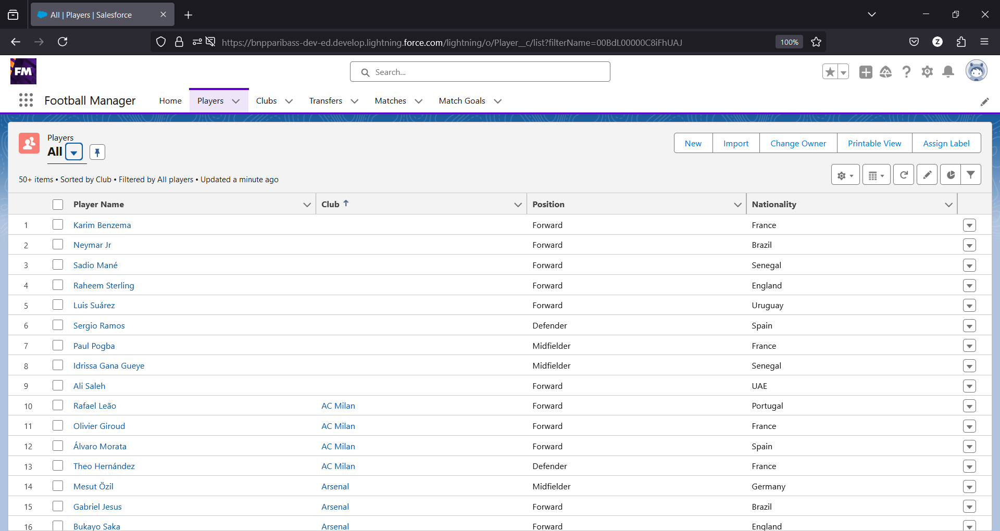
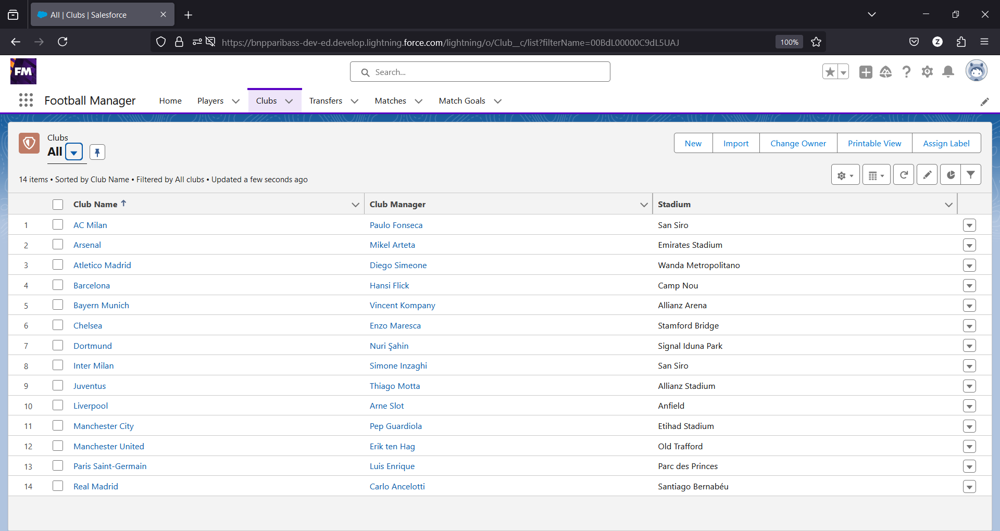
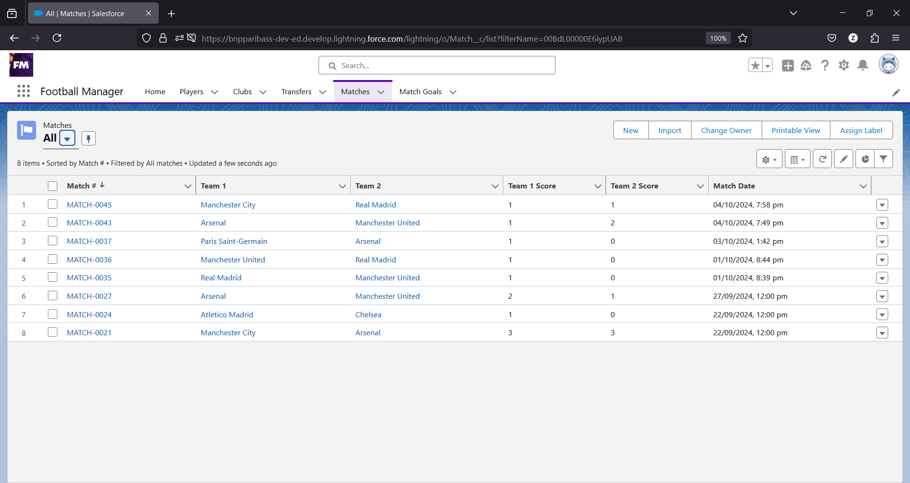
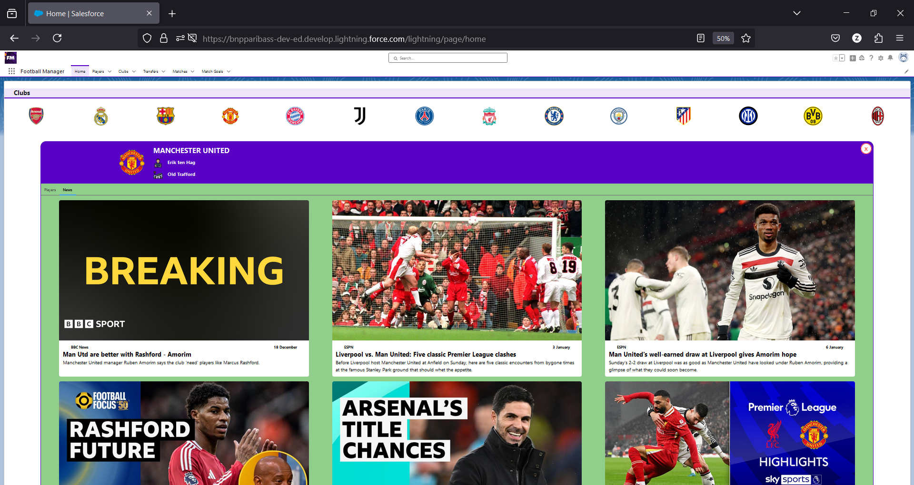
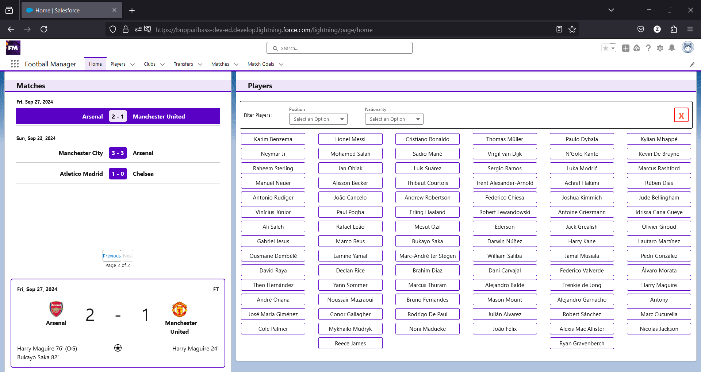

# Football Manager App

The Football Manager App is a Salesforce-based application designed to manage football-related data, including players, clubs, matches, goals, and transfers. The app leverages Salesforce Lightning Web Components (LWC), Apex, SOQL, Approval Processes, Flows, Triggers, and other Salesforce features to provide a robust and interactive platform for football management. This project also serves as a learning tool to explore Salesforce development concepts.


## Features

### 1. Players Management
- Displays a list of all Players with filtering options based on playing Position and Nationality
- Implements parent-to-child and child-to-parent communication between Lightning Web Components for filtering Players



### 2. Club Management
- Displays Clubs with their Players and related News
- Includes relationships between Clubs and Players



### 3. Match Management
- Tracks Match records and dynamically displays Match Goals
- Allows users to add Goals for a Match through a Flow
- Displays results in a tabular format with Pagination



### 4. Goal Tracking
- Tracks individual Goals for a Match and aggregates goals for each Player
- Implements automated scoring logic using Apex Triggers


### 5. Player Transfers
- Supports Player Transfers between Clubs with a comprehensive Approval Process
- Implements multi-step Approval Processes for Current Club Manager and/or New Club Manager


## Technical Components

### Custom Objects
- `Players__c`, `Clubs__c`, `Transfers__c`, `Matches__c`, `Match_Goals__c`

### Relationships
- **Lookup:** Player-Club, Match-Club, Transfer-Club, Transfer-Player, MatchGoal-Player
- **Master-Detail:** Match-MatchGoal, Player-MatchGoal

### Lightning Web Components (LWC)
-  `Clubs`, `Club`



-  `Matches`, `Match`


-  `Players`, `Player`, `PlayerFilter`


### Apex Classes
- `FootballManager`: Main controller class for the app
- `NewsService`: Fetches News related to Clubs through external integration

### Apex Triggers
- `MatchGoalTrigger`: Updates the Match Score whenever a new Goal record is created for a Match.
- `TransferTrigger`: Populates the Player's Club, Current Manager, and/or New Manager for Approval based on Transfer type.

### Approval Processes
- **Club Transfer, Free Agent Signing, Player Release:** Sends Approval requests to the Current and/or New Manager of the Club based on the Transfer type.

### Flows
- `New_Match`: Screen Flow for entering a Match record along with individual Goals scored.
- `Player_Transfer`: Record-triggered Flow for updating the Player's Club field after Transfer Approval is completed.

## Installation

### Prerequisites
1. Salesforce Developer Org
2. Salesforce CLI
3. Git
4. Visual Studio Code with Salesforce Extension Pack (recommended)

### Installation Steps

1. Clone the repository:
   ```bash
   git clone https://github.com/zeeshanhaque/Football-Manager.git
   cd football-manager
   ```

2. Authorize your Salesforce org:
   ```bash
   sf org login web -a <your-alias>
   ```

3. Deploy the source to your org:
   ```bash
   sf project deploy start
   ```
